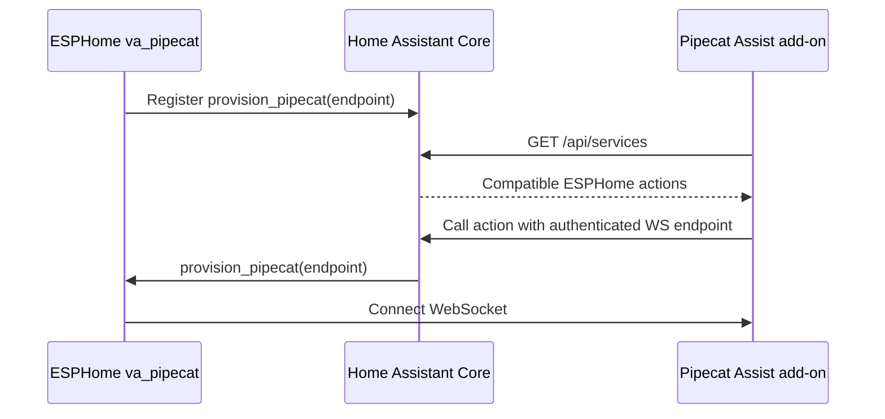
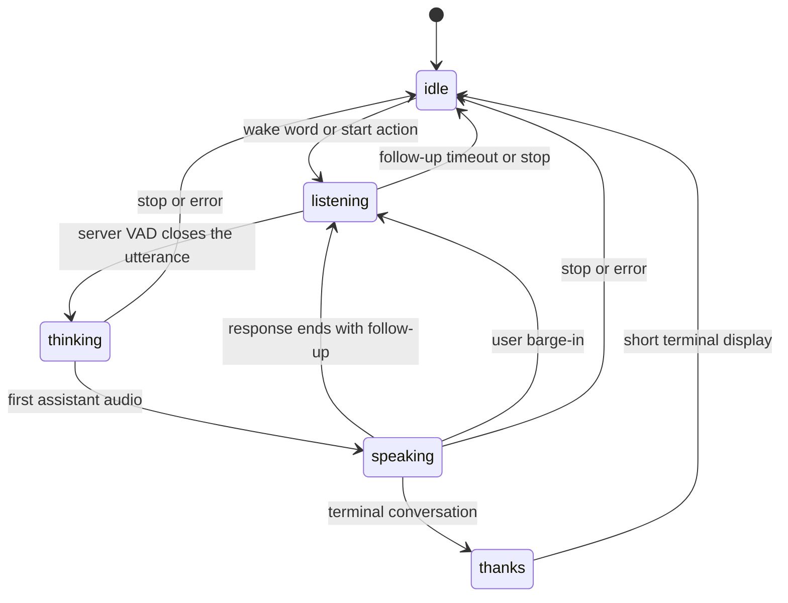

# ESPHome `va_pipecat`

`va_pipecat` connects an ESPHome voice satellite directly to Pipecat Assist.
It is intended for ESP32 devices using ESP-IDF, PSRAM, a 16 kHz mono
microphone source, and an ESPHome `speaker`.

The component uses a versioned WebSocket protocol:

- microphone uplink: PCM signed 16-bit little-endian, mono, 16 kHz;
- assistant downlink: PCM signed 16-bit little-endian, mono, 24 kHz;
- control and status: compact JSON;
- transcript text: UTF-8 encoded as Base64 inside JSON;
- server-driven phases: `idle`, `listening`, `thinking`, `speaking`, and
  `thanks`;
- full-duplex barge-in when the configured microphone source includes suitable
  echo control.

This is not a port of `pipecat-esp32`. That project owns the complete audio and
WebRTC stack for selected boards. `va_pipecat` instead composes with ESPHome's
microphone, speaker, wake-word, automations, and device UI.

## Configuration

By default, the Pipecat Assist add-on discovers compatible devices through
Home Assistant and provisions the authenticated endpoint automatically. Enable
dynamic native API actions in ESPHome; do not publish the URL as a text entity.

```yaml
external_components:
  - source: github://kyvaith/pipecat-homeassistant@dev
    components:
      - va_pipecat

psram:

api:
  custom_services: true

va_pipecat:
  id: pipecat_va
  auto_provision: true
  microphone:
    microphone: processed_microphone
    channels: 0
  speaker: assistant_speaker
  barge_in: true
  playback_buffer_size: 2MB

  on_phase:
    - logger.log:
        format: "Pipecat phase: %s"
        args: [phase.c_str()]

  on_transcript:
    - logger.log:
        format: "%s: %s"
        args: [role.c_str(), text.c_str()]

  on_audio_level:
    - lambda: |-
        // Both values are normalized to 0.0-1.0. Use input while listening
        // and output while speaking to drive a lightweight voice visualizer.
        id(voice_visualizer).set_levels(input_level, output_level);

  on_error:
    - logger.log:
        level: ERROR
        format: "Pipecat error %s: %s"
        args: [code.c_str(), message.c_str()]

micro_wake_word:
  # Configure models and the microphone as usual.
  on_wake_word_detected:
    - va_pipecat.start: pipecat_va

button:
  - platform: template
    name: Stop Pipecat conversation
    on_press:
      - va_pipecat.stop: pipecat_va
```

### Options

- **`auto_provision`** (optional, default `true`): register a device-scoped
  `provision_pipecat(endpoint)` native API action. This requires
  `api.custom_services: true`. The add-on periodically invokes the action, so
  the endpoint is restored after device or Home Assistant restarts without
  storing its token in an entity.
- **`url`** (optional): manual authenticated `ws://` or `wss://` fallback. It
  can be changed at runtime with `va_pipecat.set_url`. It is required only when
  `auto_provision` is disabled.
- **`microphone`** (required): one 16-bit mono ESPHome microphone source. The
  source is validated at 16 kHz.
- **`speaker`** (required): ESPHome speaker that accepts mono PCM16 playback.
- **`barge_in`** (optional, default `true`): keep microphone audio flowing
  while the assistant speaks. Enable this only when the selected microphone
  path suppresses playback echo well enough for server VAD.
- **`playback_buffer_size`** (optional, default `2MB`): PSRAM jitter buffer for
  assistant audio. Valid range: 64 kB to 4 MB.
- **`on_phase`**: receives the canonical phase string.
- **`on_transcript`**: receives `role` (`user` or `assistant`) and cumulative
  phrase text. The server coalesces token streams at punctuation, bounded word
  intervals, and final transcription boundaries so display clients do not
  redraw for every model token.
- **`on_audio_level`**: receives normalized `input_level` and `output_level`
  values at up to 30 Hz. The component derives a low-cost PCM envelope after
  microphone channel selection and after assistant output volume scaling. It
  uses attack/release smoothing and emits zero after a silent source timeout;
  it does not run an FFT or allocate from an audio callback.
- **`on_error`**: receives a stable error `code` and a human-readable
  `message`.
- **`on_repeated_failure`**: fires after repeated WebSocket reconnect failures.
- **`on_followup_opened`**: compatibility hook for a device-managed follow-up
  chime. Normal Pipecat follow-up turns do not require it.

### Actions and condition

- `va_pipecat.start`: open a new wake-word turn.
- `va_pipecat.interrupt`: cancel current assistant output and keep the
  conversation available for barge-in.
- `va_pipecat.stop`: end the local conversation and return to `idle`.
- `va_pipecat.set_url`: replace the endpoint and reconnect.
- `va_pipecat.set_volume`: set the assistant PCM output multiplier from 0 to
  100%.
- `va_pipecat.connected`: true while the WebSocket is connected.

## Automatic provisioning



The add-on resolves the device-reachable host from Home Assistant's
`internal_url`. **Runtime > ESPHome satellite > Device-reachable host
override** can be used when that hostname is not reachable from the device.
The endpoint token is sent only as transient action data; status responses and
logs contain counts and errors, never the complete URL.

## Conversation lifecycle



The server phase is authoritative, but `speaking` remains visible until the
device's PSRAM and downstream speaker buffers have actually drained. This
prevents music resume or UI teardown while the final audio is still audible.

## Home Assistant Voice: Preview Edition

`examples/home-assistant-voice-pe.yaml` is a complete configuration for the
Home Assistant Voice: Preview Edition. It is the official configuration with
the wake word wired to Pipecat Assist instead of Home Assistant Assist.

1. In **ESPHome Builder**, take control of the device (**Adopt**). Keep the
   generated `api: encryption: key:` and Wi-Fi settings: you need them in
   step 3.
2. Copy `examples/home-assistant-voice-pe.yaml` over the generated
   configuration.
3. Put your encryption key back under `api:` and your Wi-Fi settings back
   under `wifi:`, then install the firmware over the air.
4. Start the Pipecat Assist add-on. It discovers the satellite through Home
   Assistant and provisions the authenticated endpoint automatically.

What stays as it is: the LED ring, the buttons, timers, the media player, and
the built-in Home Assistant Assist pipeline, which the center button still
starts. What changes: the wake word starts a Pipecat conversation, the
satellite is provisioned through a native API action (`api:
custom_services: true`), and the LED ring follows the phases the satellite
reports.

The microphone uses channel 0, the echo-cancelled output of the XMOS chip, so
you can talk over the assistant. The assistant speaks through the
announcement speaker, and music is ducked while it talks.

The configuration is derived, not maintained by hand. Re-derive it when the
official configuration changes:

```bash
python3 examples/derive_voice_pe_config.py > examples/home-assistant-voice-pe.yaml
```

To go back to the official firmware, use the
[web installer](https://esphome.github.io/home-assistant-voice-pe/) over USB-C
in Chrome or Edge. It reinstalls the stock firmware, after which Home
Assistant adopts the device again as a standard voice satellite.

OpenAI Live (`gpt-live-1`) pipelines need add-on 0.1.85 or later, which holds
a Live session only while a conversation runs.
